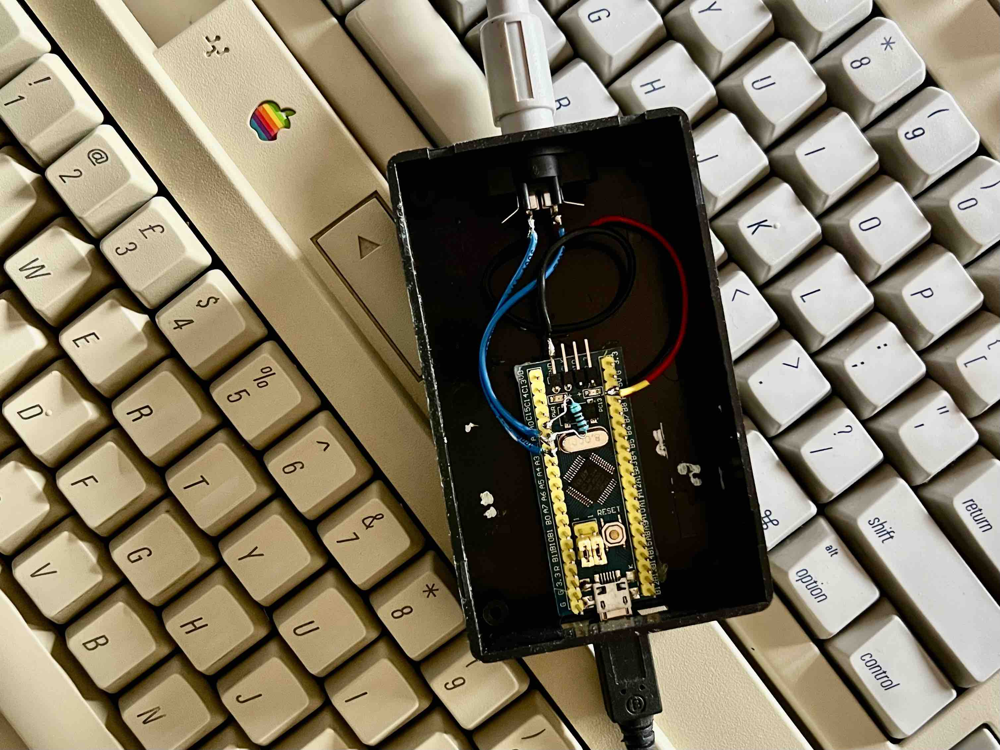

# adb2usb
ADB to USB hardware interface for using old Apple keyboards on modern computers.



# Tools
For the development of the firmware I used:
 - Compiler: Arduino 1.8.10 in OSX 10.15 (19A602) (Catalina)
 - STM32 board definition: STM32F1xx/GD32F1xx boards by stm32duino version 2019.10.9
I installed these boards definitions adding the "Additional Boards Manager URL" from:
http://dan.drown.org/stm32duino/package_STM32duino_index.json

# Building / Testing

 - Set the top jumper to 1 (when seen with the USB on the left).
 - Connect the serial-USB board:

```
    Serial
    USB       STM32 board
    ---------------------
    GND   ->  GND
    5V    ->  5V
    TXD   ->  A10
    RXD   ->  A9
```

 - Do not connect the USB from the blue pill before flashing.
 - Flash firmware.
 - Connect blue pill to host and test that it works.

# Flashing device

To change the serial number, find in the bin file the string "01234567891011121314" and replace it
with another one (of same length) with the desired value before flashing.

/Users/youruser/Library/Arduino15/packages/stm32duino/tools/stm32tools/2019.10.9/macosx/serial_upload cu.usbserial-1410 {upload.altID} {upload.usbID} buildPath/firmware_1.0.ino.bin 

# Release
Set both jumpers to 0.
